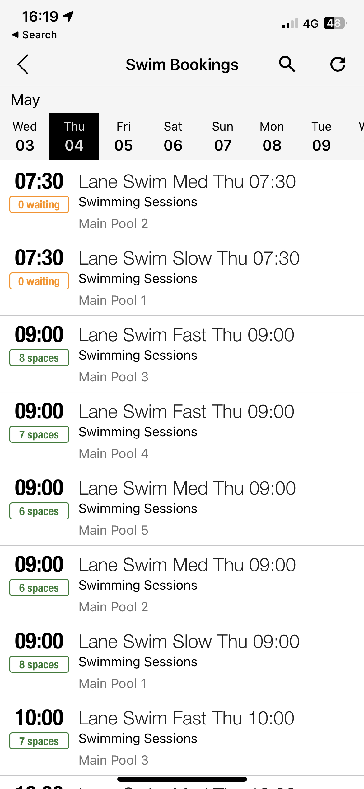

## Lane Availability Data Sources

### Active Lambeth

Active Lambeth is a new swimming pool operator that runs 8 pools. It was relatively
simple to identify from the [Active Lambeth website](https://active.lambeth.gov.uk) that
the following APIs can be used to fetch lane availability (including the number of
remaining spaces)

#### Get Venues

```bash
curl 'https://flow.onl/api/activities/venues' \
-H 'origin: https://lambethcouncil.bookings.flow.onl' \
-H 'accept: application/json'
```

#### Get Times for Venues

```bash
curl 'https://flow.onl/api/activities/venue/clapham-leisure-centre/activity/adult-lane-swimming/times?date=2023-04-18' \
-H 'origin: https://lambethcouncil.bookings.flow.onl' \
-H 'authority: flow.onl' \
-H 'accept: application/json'
```

with response

```json
{
  "data": {
    "31": {
      "starts_at": {
        "format_12_hour": "11:10am",
        "format_24_hour": "11:10"
      },
      "ends_at": {
        "format_12_hour": "12:00pm",
        "format_24_hour": "12:00"
      },
      "duration": "50min",
      "price": {
        "is_estimated": false,
        "formatted_amount": "£5.92"
      },
      "composite_key": "19090b77",
      "timestamp": 1683022200,
      "booking": null,
      "action_to_show": {
        "status": "BOOK",
        "reason": null
      },
      "category_slug": "adult-lane-swimming",
      "date": "2023-05-02",
      "venue_slug": "clapham-leisure-centre",
      "location": "Main Pool Lane 1, Clapham Leisure Centre",
      "spaces": 4,
      "name": "Adult Lane Swimming",
      "allows_anonymous_bookings": false
    },
    ...
  }
}
```

### Everyone Active

#### Everyone Active Website

The Everyone Active website uses SSR hence it is difficult to identify an API
which can provide availability. I have considered scraping the website (e.g. using Selenium)
however, this would be a last resort.

#### Reverse Engineering the Everyone Active IOS Application

Everyone Active provide an IOS application to enable you to book activities:

<p align="center">
  
</p>

This includes time, lane speed and number of available slots. However, as it is a native
application it is hard to find where this is data is coming from.

Here comes [mitmproxy](https://blog.kulman.sk/debugging-ios-network-traffic/), a very useful (and free)
HTTP proxy which enables you to debug network traffic from your phone configuring your phone to route requests
via an intermediate proxy. This identified the following apis:

##### Auth Token

```bash
curl "https://caching.everyoneactive.com/aws/api/token?locale=en_GB" \
-H "user: <USERNAME>"
-H "pw: <PASSWORD>" \
-H "authenticationkey: <KEY>"
```

will provide the JWT:

```json
{
  "memberId": "<MEMBER_ID>",
  "jwtToken": "<JWT_ACCESS_TOKEN>",
  "timeValidUntil": 1683129341,
  "apiVer": "4.14.0.10186"
}
```

##### Sessions

```bash
curl "https://caching.everyoneactive.com/aws/api/session?locale=en_GB&fromUTC=1683414000&scopeIds=155POOLPR1&globalInfo=1&toUTC=1683500400" \
-H "accept: application/json" \
-H "authenticationkey: <KEY>" \
-H "authorisation: Bearer <JWT_ACCESS_TOKEN>"
```

note that the authorization header seems optional....

Example response

```json
{
 "responseDocType": "SESSION_LIST_RESPONSE",
 "docver": 1,
 "authUserKbType": "email",
 "authPassKbType": "alpha",
 "authUserLabel": "Email Address",
 "authPassLabel": "Password",
 "sessions": [
   {
     "id": 326192486,
     "title": "Lane Swim Fast Sun 08:00",
     "description": "This session is in the Main Pool.<br>Structured session for confident swimmers able to swim continuously in a lane.<br>Fast Lane customer will swim majority of session front crawl and on average will complete 25 metres in under 30 secs.",
     "siteId": "0155",
     "siteName": "Queen Mother Sport Centre",
     "siteTimezone": 60,
     "siteAllowsSelfRegistration": true,
     "type": "Swimming Sessions",
     "startTimeUTC": 1683442800,
     "endTimeUTC": 1683446399,
     "imageURL": null,
     "resourceId": "155ZMP003",
     "resourceName": "Main Pool 3",
     "cost": "£8.05",
     "slotsTotal": 8,
     "slotsAvailable": 7,
     "waitListCount": 0,
     "myBookingStatus": "Unknown",
     "myBookingRef": null,
     "statusText": "You have not booked this session.",
     "waitListPos": null,
     "reqPay": true,
     "showCancel": false,
     "showBook": true,
     "showPay": false,
     "reservationId": "1557WS4FM080001",
     "activityGroupDesc": "Swimming Sessions",
     "activityGroupID": "155POOLPR1",
     "payOption": {
       "responseDocType": "PAYOPTION_RESPONSE",
       "docver": 1,
       "totalPoints": 0,
       "totalValue": 0,
       "spendablePoints": 0,
       "spendableValue": 0,
       "cashlessValue": null,
       "spendableCashlessValue": 0
     },
     "addonOptions": [],
     "bookDetails": [],
     "bookUrl": "https://caching.everyoneactive.com/aws/api/Book?sessionId=326192486",
     "cancelUrl": null,
{
 "responseDocType": "SESSION_LIST_RESPONSE",
 "docver": 1,
 "authUserKbType": "email",
 "authPassKbType": "alpha",
 "authUserLabel": "Email Address",
 "authPassLabel": "Password",
 "sessions": [
   {
     "id": 326192486,
     "title": "Lane Swim Fast Sun 08:00",
     "description": "This session is in the Main Pool.<br>Structured session for confident swimmers able to swim continuously in a lane.<br>Fast Lane customer will swim majority of session front crawl and on average will complete 25 metres in under 30 secs.",
     "siteId": "0155",
     "siteName": "Queen Mother Sport Centre",
     "siteTimezone": 60,
     "siteAllowsSelfRegistration": true,
     "type": "Swimming Sessions",
     "startTimeUTC": 1683442800,
     "endTimeUTC": 1683446399,
     "imageURL": null,
     "resourceId": "155ZMP003",
     "resourceName": "Main Pool 3",
     "cost": "£8.05",
     "slotsTotal": 8,
     "slotsAvailable": 7,
     "waitListCount": 0,
     "myBookingStatus": "Unknown",
     "myBookingRef": null,
     "statusText": "You have not booked this session.",
     "waitListPos": null,
     "reqPay": true,
     "showCancel": false,
     "showBook": true,
     "showPay": false,
     "reservationId": "1557WS4FM080001",
     "activityGroupDesc": "Swimming Sessions",
     "activityGroupID": "155POOLPR1",
     "payOption": {
       "responseDocType": "PAYOPTION_RESPONSE",
       "docver": 1,
       "totalPoints": 0,
       "totalValue": 0,
       "spendablePoints": 0,
       "spendableValue": 0,
       "cashlessValue": null,
       "spendableCashlessValue": 0
     },
     "addonOptions": [],
     "bookDetails": [],
     "bookUrl": "https://caching.everyoneactive.com/aws/api/Book?sessionId=326192486",
     "cancelUrl": null,
   }
   ...
 ]
}
```

### Better

Inspecting the Better website e.g. https://www.better.org.uk/leisure-centre/london/lambeth/vauxhall-leisure-centre/timetable/pool
showed that the following api can be used:

`https://www.better.org.uk/api/venues/vauxhall-leisure-centre/timetable/2023/05/04.json?wp_heading_id=2`

however when checking the better application - an api very similar to Active Lambeth was discovered, hence this is prefered as it does not rely on magic heading query parameters

```bash
curl 'https://better-admin.org.uk/api/activities/venue/vauxhall-leisure-centre/activity/swim-for-fitness/times?date=2023-05-03' \
-H 'origin: https://bookings.better.org.uk' \
-H 'accept: application/json'
```

with response:

```json
{
  "data": {
    "50": {
      "starts_at": {
        "format_12_hour": "6:20pm",
        "format_24_hour": "18:20"
      },
      "ends_at": {
        "format_12_hour": "7:10pm",
        "format_24_hour": "19:10"
      },
      "duration": "50min",
      "price": {
        "is_estimated": false,
        "formatted_amount": "£5.15"
      },
      "composite_key": "a640cbd0",
      "timestamp": 1683134400,
      "booking": null,
      "action_to_show": {
        "status": null,
        "reason": "The item being booked is already full"
      },
      "category_slug": "swim-for-fitness",
      "date": "2023-05-03",
      "venue_slug": "vauxhall-leisure-centre",
      "location": "Main Pool Lane 1, Vauxhall Leisure Centre",
      "spaces": 0,
      "name": "Swim for Fitness",
      "allows_anonymous_bookings": false
    },
    ...
  }
}
```
